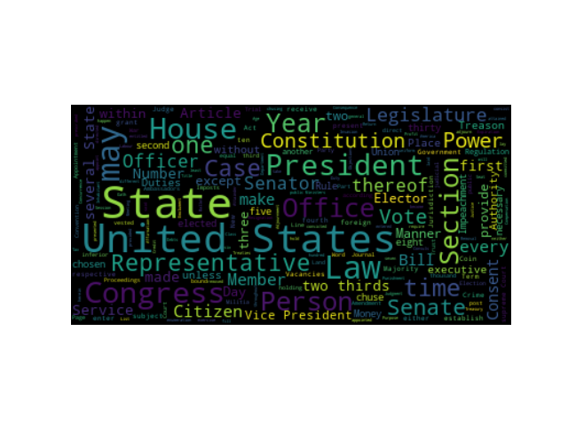
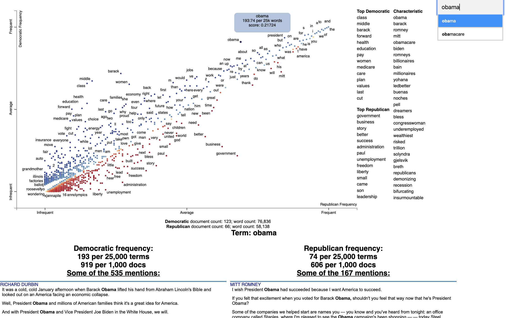

Since processing, analyzing and visualizing text data is so common, this package
provides and alternative to existing packages in the Python ecosystem with specific, but configurable stylistic choices.

Ease of use and development speed using the package functions will be a major advantage of the this package over others at the expense of a bit of generalization, which is already available in many other packages (see examples in *Relation to Existing Package Ecosystem*  below).

The functions implemented will be tested against other existing solutions to validate their outputs as being correct, making their use
being a stylistic design choice rather than different functionality altogether.

1. A function to clean/preprocess a block of input text data.

    * The function will remove punctuation and set all words to lower case for easier analysis, for example to obtain the counts of each of the unique words that appear in the text.
    * Options for how the text block shall be processed will be included in the function as optional arguments.
    * The function will be implemented such that it can be used independently of the other functions in this package or the following functions below may be used sequentially.

2. A function to count the number instances of unique words in a block of cleaned input text data.

    * The function will return a dictionary of unique words as keys and their corresponding values will contain the counts of the word in the input text.
    * Optional arguments for the function will modify the return of the counts based on user input, for example ignoring certain words for counting.
    * The function will be implemented such that it can be used independently of the other functions in this package or used sequentially, provided that the input text data is in a compatible format or has been preprocessed using the function in the package.

3. A function to visualize the top counts or frequencies of occurrence of the words within the input text.

    * The function will return a bar plot of the frequencies of the top words for ease of visualization, formatted with proper data visualization practices.
    * Optional arguments will control what is displayed in the plot generated, for example the maximum number of words to display.
    * The function will be implemented such that it can be used independently of the other functions in this package or used sequentially, provided the input is in the proper format.

    There exists other packages in the Python ecosystem which are capable of performing in essence the same tasks as this package, however there are stylistic implementation differences, for which the end-user may prefer. Overall, the landscape for text processing is quite saturated in the python ecosystem. This is due to text parsing being such a common task and the Python ecosystem being so vast. For example, the visualization packages for text data that exist already are not as specific as the implementation contained in this package, they are more generic but may require more lines of code to reproduce the output of this package.

Similarly, the text cleaning/preprocessing functionality of this package likely does not exist already in the ecosystem in the exact same implementation and may have stylistic differences, but similar operations can be done with other packages to obtain the same modified text string. The unique word count functionality of this package is likely implemented differently "under the hood" than other solutions present in the ecosystem in the same way, but will produce the same final output as existing packages. Examples of existing packages are shown below (not an exhaustive list):

### Existing Package Examples


### Text visualization


###### 1. [WordCloud on PyPI](https://pypi.org/project/wordcloud/)

[WordCloud GitHub Repository](https://github.com/amueller/word_cloud)

Minimal Example:

```python
import os

from os import path
from wordcloud import WordCloud

# get data directory (using getcwd() is needed to support running example in generated IPython notebook)
d = path.dirname(__file__) if "__file__" in locals() else os.getcwd()

# Read the whole text.
text = open(path.join(d, 'constitution.txt')).read()

# Generate a word cloud image
wordcloud = WordCloud().generate(text)

# Display the generated image:
# the matplotlib way:
import matplotlib.pyplot as plt
plt.imshow(wordcloud, interpolation='bilinear')
plt.axis("off")

# lower max_font_size
wordcloud = WordCloud(max_font_size=40).generate(text)
plt.figure()
plt.imshow(wordcloud, interpolation="bilinear")
plt.axis("off")
plt.show()

# The pil way (if you don't have matplotlib)
# image = wordcloud.to_image()
# image.show()
```


##### 2. [Scattertext on PyPI](https://pypi.org/project/scattertext/)

[Scattertext GitHub Repository](https://github.com/JasonKessler/scattertext)

Minimal Example:

```python
import scattertext as st

df = st.SampleCorpora.ConventionData2012.get_data().assign(
    parse=lambda df: df.text.apply(st.whitespace_nlp_with_sentences)
)

corpus = st.CorpusFromParsedDocuments(
    df, category_col='party', parsed_col='parse'
).build().get_unigram_corpus().compact(st.AssociationCompactor(2000))

html = st.produce_scattertext_explorer(
    corpus,
    category='democrat',
    category_name='Democratic',
    not_category_name='Republican',
    minimum_term_frequency=0, 
    pmi_threshold_coefficient=0,
    width_in_pixels=1000, 
    metadata=corpus.get_df()['speaker'],
    transform=st.Scalers.dense_rank,
    include_gradient=True,
    left_gradient_term='More Republican',
    middle_gradient_term='Metric: Dense Rank Difference',
    right_gradient_term='More Democratic',
)
open('./demo_compact.html', 'w').write(html)
```



### Text cleaning/preprocessing


##### 1. [CleanText on PyPI](https://pypi.org/project/cleantext/)

[CleanText GitHub Repository](https://github.com/prasanthg3/cleantext)

Minimal Example:

```python
import cleantext

cleantext.clean('This is A s$ample !!!! tExt3% to   cleaN566556+2+59*/133',
 extra_spaces=True, lowercase=True, numbers=True, punct=True)
>>>
'this is a sample text to clean'
```

##### 2. [clean-text on PyPI](https://pypi.org/project/clean-text/)

[clean-text GitHub Repository](https://github.com/jfilter/clean-text)

Minimal Example:

```python
from cleantext import clean

# Preserve a literal compound word while removing other punctuation
clean("drive-thru and text---cleaning", no_punct=True, exceptions=["drive-thru"])
>>>
'drive-thru and textcleaning'
```


### Text analysis


1. [NLTK on PyPI](https://pypi.org/project/nltk/)

[NLTK GitHub Repository](https://github.com/nltk/nltk)

Minimal Example:

```python
>>> import nltk
>>> sentence = """At eight o'clock on Thursday morning
... Arthur didn't feel very good."""
>>> tokens = nltk.word_tokenize(sentence)
>>> tokens
['At', 'eight', "o'clock", 'on', 'Thursday', 'morning',
'Arthur', 'did', "n't", 'feel', 'very', 'good', '.']
>>> tagged = nltk.pos_tag(tokens)
>>> tagged[0:6]
[('At', 'IN'), ('eight', 'CD'), ("o'clock", 'JJ'), ('on', 'IN'),
('Thursday', 'NNP'), ('morning', 'NN')]
```

2. [spaCy on PyPI](https://pypi.org/project/spacy/)

[spaCy GitHub Repository](https://github.com/explosion/spaCy)

Minimal Example:

```python
# pip install -U spacy
# python -m spacy download en_core_web_sm
import spacy

# Load English tokenizer, tagger, parser and NER
nlp = spacy.load("en_core_web_sm")

# Process whole documents
text = ("When Sebastian Thrun started working on self-driving cars at "
        "Google in 2007, few people outside of the company took him "
        "seriously. “I can tell you very senior CEOs of major American "
        "car companies would shake my hand and turn away because I wasn’t "
        "worth talking to,” said Thrun, in an interview with Recode earlier "
        "this week.")
doc = nlp(text)

# Analyze syntax
print("Noun phrases:", [chunk.text for chunk in doc.noun_chunks])
print("Verbs:", [token.lemma_ for token in doc if token.pos_ == "VERB"])

# Find named entities, phrases and concepts
for entity in doc.ents:
    print(entity.text, entity.label_)
>>>
'''Noun phrases: ['Sebastian Thrun', 'self-driving cars', 'Google', 'few people', 'the company', 'him', 'I', 'you', 'very senior CEOs', 'major American car companies', 'my hand', 'I', 'Thrun', 'an interview', 'Recode']
Verbs: ['start', 'work', 'drive', 'take', 'tell', 'shake', 'turn', 'talk', 'say']
Sebastian Thrun PERSON
Google ORG
2007 DATE
American NORP
Thrun GPE
Recode ORG
earlier this week DATE'''
```